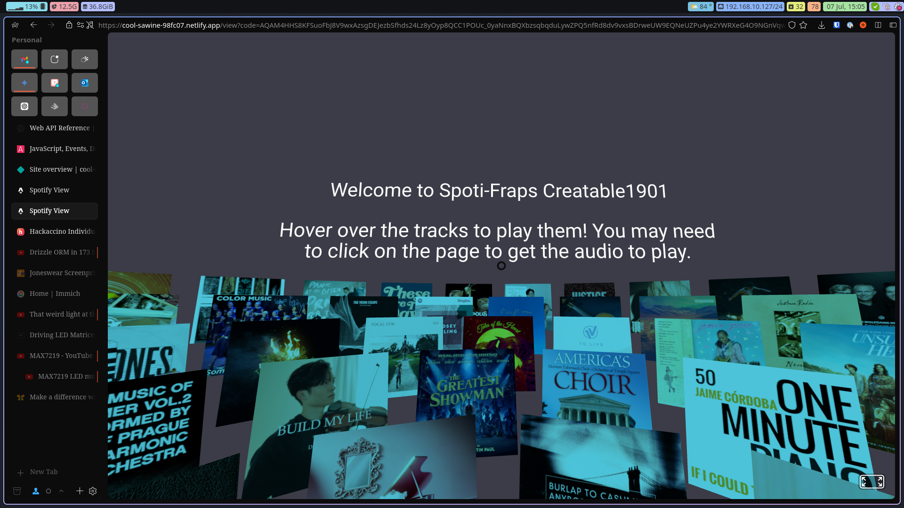

# Spoti-Fraps - Spotify Top Tracks Viewer

Spoti-Fraps is a simple web application that allows you to view the top tracks of your library in a 3d environment. It uses the Spotify API to fetch the top tracks of the user and displays them in a 3d environment using A-Frame!

